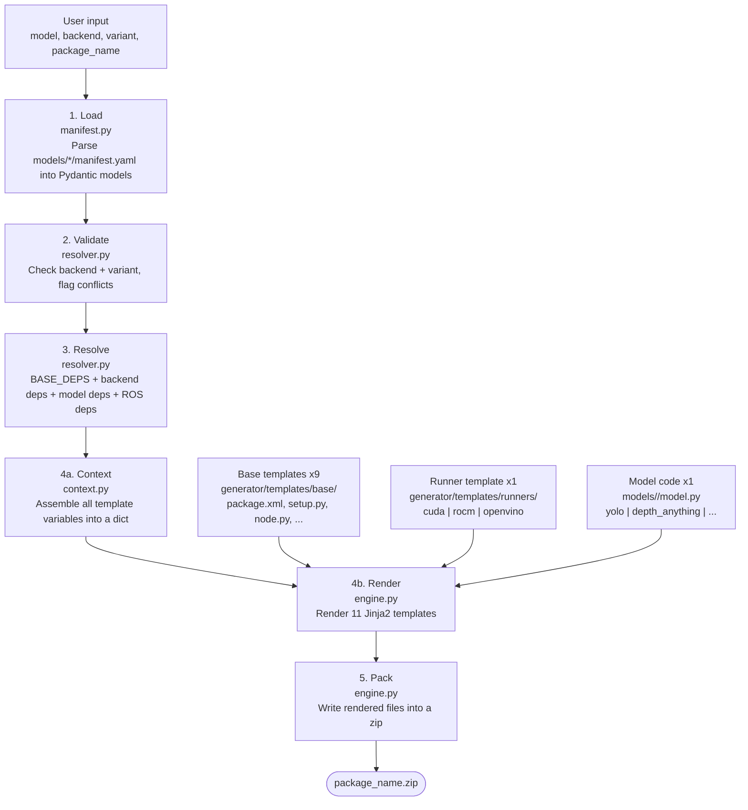
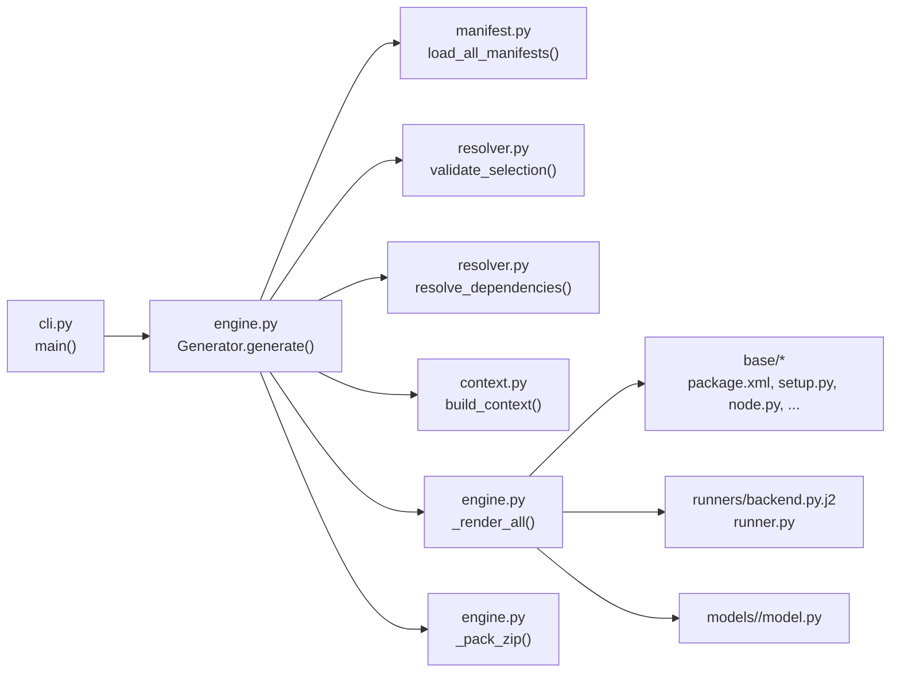

# vision-factory

A code generator that produces self-contained ROS2 vision packages. Pick a model, a hardware backend, and a variant — get a ready-to-build colcon package as a zip file.

## Why a Generator?

Vision-factory is a **code generator**, not a monolithic "one node to rule them all" ROS package. This is a deliberate choice.

A single universal node that supports every model and every backend would accumulate the union of all dependencies: PyTorch, TensorRT, ONNX Runtime, OpenVINO, Ultralytics, Transformers, Detectron2, and so on. That image would be enormous, most of it unused for any given deployment. Worse, these libraries frequently conflict — TensorRT pins specific CUDA versions, OpenVINO ships its own NumPy expectations, and different model families pull in incompatible versions of the same packages. A fat node becomes a dependency management nightmare that gets worse with every model you add.

By generating standalone packages, each output contains only the code and dependencies it actually needs. A YOLO + CUDA package pulls in `ultralytics` and `torch+cu124`. A Depth Anything + ONNX package pulls in `onnxruntime` and `transformers`. Neither drags in the other's stack. The generated packages are small, self-documenting, and easy to audit — you can read every line of code that will run on your robot.

This also makes development straightforward. Adding a new model means writing a `manifest.yaml` and a `model.py` — you don't need to understand or modify a sprawling runtime. Adding a new backend means writing one runner template. There's no risk of a change to the YOLO runner breaking Grounding DINO, because they don't share runtime code. Each generated package is its own island.

## Supported Models

| Model | Output | Variants |
|-------|--------|----------|
| YOLO | Object detection (xyxy) | v8n, v8s, v8m, v8l, v8x, v11n, v11s, v11m, v11l |
| Depth Anything | Depth map | vits, vitb, vitl (v1 & v2) |
| Grounding DINO | Detection + text prompts | tiny, base |
| Segment Anything | Segmentation masks | hiera_t/s/b+/l, large, huge |
| Florence | Multi-task VLM | base, base-ft, large, large-ft |
| RTMPose | Keypoint detection | body-s/m/l, hand, face, wholebody-s/m/l |
| ZoeDepth | Monocular depth | nyu, kitti, nyu-kitti |
| ByteTrack | Multi-object tracking | - |

## Hardware Platforms

Different robots and edge devices ship with different hardware. The backend you choose depends on what's on the board.

### NVIDIA GPUs (desktop, workstation, data center)

Desktop and workstation GPUs (RTX 3000/4000/5000 series, A-series, etc.) have the broadest support. Use `--backend cuda` for development and `--backend tensorrt` for optimized deployment. All models work with CUDA. TensorRT currently supports YOLO.

```bash
# Development — PyTorch with torch.compile
vision-factory generate --model yolo --backend cuda --variant yolo_v8s --package-name my_detector

# Production — TensorRT compiled engine
vision-factory generate --model yolo --backend tensorrt --variant yolo_v8s --package-name my_detector
```

### NVIDIA Jetson (Orin, Xavier, Nano)

Jetson devices run the same CUDA and TensorRT stacks as desktop NVIDIA GPUs but with ARM CPUs and shared GPU memory. The generated packages work without modification — use `--backend cuda` for flexibility or `--backend tensorrt` for the best inference throughput on Jetson's constrained power budget. TensorRT is particularly valuable here since Jetson devices are typically deployed with strict latency requirements.

```bash
# Jetson deployment — TensorRT for best perf/watt
vision-factory generate --model yolo --backend tensorrt --variant yolo_v8n --package-name jetson_detector
```

### AMD GPUs (Radeon, Instinct)

AMD GPUs are supported via PyTorch's ROCm backend. The generated code is identical to CUDA — PyTorch abstracts both under the same `cuda` device API. The difference is the pip dependencies: the package installs `torch` from the `rocm6.2` index instead of `cu124`. ROCm support is less mature than CUDA in the broader ML ecosystem, but well-supported models work without issues.

```bash
vision-factory generate --model depth_anything --backend rocm --variant depth_anything_v2_vitb --package-name depth_node
```

### Intel CPUs and iGPUs (NUC, industrial PCs)

For x86 deployments without a discrete GPU, use `--backend openvino`. OpenVINO applies Intel-specific optimizations (layer fusion, INT8 quantization) that run significantly faster than naive CPU inference. This is the right choice for Intel NUCs, industrial PCs, and any x86 edge device where no NVIDIA or AMD GPU is available.

```bash
vision-factory generate --model yolo --backend openvino --variant yolo_v8n --package-name edge_detector
```

### NPUs (Intel Core Ultra, AMD Ryzen AI, Qualcomm Snapdragon X)

Recent laptop and desktop processors ship with dedicated neural processing units — Intel's NPU in Core Ultra 2/3 series, AMD's XDNA in Ryzen AI (HX 370, etc.), and Qualcomm's Hexagon in Snapdragon X Elite. These are the "Copilot+ PC" chips. Vision-factory can target them through existing backends, no special NPU backend needed.

**Intel Core Ultra NPUs** are supported through OpenVINO. The OpenVINO runtime auto-detects the NPU and can offload supported models to it. Generate with `--backend openvino` and set the device to NPU at launch time.

```bash
vision-factory generate --model yolo --backend openvino --variant yolo_v8n --package-name npu_detector

# At launch, target the NPU explicitly:
ros2 launch npu_detector vision.launch.py device:=NPU
```

**AMD Ryzen AI (XDNA) NPUs** are supported through ONNX Runtime with AMD's Vitis AI execution provider. Generate with `--backend onnx` and select `VitisAIExecutionProvider` at launch. Requires the Ryzen AI SDK to be installed on the target machine.

```bash
vision-factory generate --model yolo --backend onnx --variant yolo_v8n --package-name ryzen_detector

ros2 launch ryzen_detector vision.launch.py execution_provider:=VitisAIExecutionProvider
```

**Qualcomm Snapdragon X** NPUs are also supported through ONNX Runtime, via the QNN execution provider. Generate with `--backend onnx` and select `QNNExecutionProvider` at launch. Requires the Qualcomm AI Engine Direct SDK.

```bash
vision-factory generate --model yolo --backend onnx --variant yolo_v8n --package-name snapdragon_detector

ros2 launch snapdragon_detector vision.launch.py execution_provider:=QNNExecutionProvider
```

**Caveats:** NPU support is untested. Operator coverage on NPUs is narrower than on CPUs and GPUs — simple models like YOLO will likely work, but complex attention-heavy architectures (Grounding DINO, Florence) may hit unsupported ops that silently fall back to CPU. Verify actual NPU utilization with vendor profiling tools (Intel `vtune`, AMD `amdprofsys`, Qualcomm Profiler) before assuming your model is running on the NPU.

### Mixed or unknown hardware

If you need one model artifact that runs on any hardware, use `--backend onnx`. ONNX Runtime supports multiple execution providers selectable at launch time via a ROS parameter — the same package runs on NVIDIA, AMD, Intel, or plain CPU without re-exporting.

```bash
vision-factory generate --model yolo --backend onnx --variant yolo_v8s --package-name portable_detector

# Then at launch time, pick the execution provider:
ros2 launch portable_detector vision.launch.py execution_provider:=CUDAExecutionProvider
ros2 launch portable_detector vision.launch.py execution_provider:=CPUExecutionProvider
```

## Backends

| Backend | Device | Torch Index |
|---------|--------|-------------|
| `cuda` | NVIDIA GPU | `cu124` |
| `rocm` | AMD GPU | `rocm6.2` |
| `openvino` | Intel CPU/iGPU | - |
| `tensorrt` | NVIDIA GPU (optimized) | `cu124` |
| `onnx` | CPU / any EP | - |

Not every model supports every backend — each model's `manifest.yaml` declares its supported backends. The generator will reject unsupported combinations.

### cuda

Models run through PyTorch on NVIDIA GPUs with `torch.compile` enabled by default for non-Ultralytics models (Depth Anything, Grounding DINO, etc.). `torch.compile` traces the forward pass and compiles it into fused GPU kernels via TorchInductor, eliminating Python overhead and fusing operations — typically 1.3-2x faster than eager execution after warmup. The first inference call triggers compilation and will be slow (several seconds); subsequent calls run at full speed. For Ultralytics models (YOLO), `torch.compile` is skipped because Ultralytics manages its own inference pipeline internally. You can disable compilation at launch time by setting the `use_torch_compile` ROS parameter to `false`, which is useful for debugging or if a model hits a compilation edge case.

### rocm

The AMD equivalent of the CUDA backend. It runs the same PyTorch code paths (including `torch.compile` for non-Ultralytics models) but targets AMD GPUs via the ROCm stack. The generated package is nearly identical to CUDA — the difference is the pip index URL (`rocm6.2` instead of `cu124`) and the device string. ROCm support in the broader ML ecosystem is less mature than CUDA, so expect occasional rough edges with newer model architectures, but for well-supported models like YOLO and Depth Anything it works without modification.

### tensorrt

Compiles the model into an optimized GPU engine using NVIDIA's TensorRT library. On first run, the model is exported from PyTorch to a TensorRT engine file and cached on disk; subsequent runs load the cached engine directly, skipping the export step. The compiled engine fuses operations, quantizes where possible, and runs inference significantly faster than PyTorch — typically 2-5x depending on the model and GPU. The engine is compiled for a specific GPU architecture, batch size, and input shape, so it's not portable across different GPU models. TensorRT only supports NVIDIA GPUs and currently only works with YOLO (via Ultralytics' native export path).

### onnx

Exports the model to the ONNX interchange format and runs it through Microsoft's ONNX Runtime. Like TensorRT, the first run exports and caches the `.onnx` file; subsequent runs load from cache. The key advantage is portability: ONNX Runtime supports multiple execution providers (`CPUExecutionProvider`, `CUDAExecutionProvider`, `TensorrtExecutionProvider`, `ROCMExecutionProvider`, `OpenVINOExecutionProvider`, etc.), selectable via the `execution_provider` ROS parameter at launch time. A single exported model can run on NVIDIA GPUs, AMD GPUs, Intel hardware, or plain CPU without re-exporting. Not all PyTorch operations have clean ONNX equivalents, so complex models may need custom export logic. Currently supports YOLO via Ultralytics' native ONNX export.

### openvino

Targets Intel hardware — CPUs, integrated GPUs, and VPUs. Runs inference without CUDA or any discrete GPU. OpenVINO applies Intel-specific optimizations (layer fusion, INT8 quantization on supported hardware) that make CPU inference considerably faster than naive PyTorch CPU mode. Only benefits Intel hardware — on AMD or ARM CPUs, use `onnx` with `CPUExecutionProvider` instead.

## Installation

```bash
pip install -e .

# For development (includes pytest)
pip install -e ".[dev]"
```

## Usage

### Generate a package

```bash
vision-factory generate \
  --model yolo \
  --backend cuda \
  --variant yolo_v8s \
  --package-name my_detector \
  --output ./output
```

### List available models

```bash
vision-factory list-models
```

### Get model details

```bash
vision-factory info yolo
```

### Custom paths

```bash
vision-factory generate \
  --model yolo \
  --backend cuda \
  --package-name my_pkg \
  --models /path/to/models
```

## Generated Package Structure

Each generated zip contains a complete ROS2 colcon package:

```
my_detector/
├── my_detector/
│   ├── __init__.py
│   ├── node.py           # ROS2 node entry point
│   ├── model_base.py     # Shared model code (if backend-specific)
│   ├── model.py          # Model loading and inference
│   └── runner.py         # Backend-specific inference runner
├── config/
│   └── params.yaml       # ROS2 parameters
├── launch/
│   └── vision.launch.py  # Launch file
├── package.xml           # ROS2 package manifest
├── setup.py              # Python package setup
├── requirements.txt      # pip dependencies
├── Dockerfile            # Container build
└── README.md             # Package documentation
```

## Project Structure

```
vision-factory/
├── generator/              # Core engine
│   ├── cli.py              # Click CLI
│   ├── engine.py           # Generation pipeline
│   ├── manifest.py         # YAML manifest parsing (Pydantic)
│   ├── resolver.py         # Dependency resolution
│   ├── context.py          # Jinja2 context builder
│   └── templates/          # Jinja2 templates
│       ├── base/           # ROS2 package scaffolding (9 templates)
│       └── runners/        # Backend runners (cuda, rocm, openvino, tensorrt, onnx)
├── models/                 # Model definitions + implementations
│   ├── base_model.py       # Shared HF base class (copied into packages)
│   ├── yolo/
│   │   ├── manifest.yaml   # Model manifest
│   │   ├── model_base.py   # Shared model code
│   │   ├── model.py        # Default backend (re-exports base)
│   │   ├── model_tensorrt.py # TensorRT export/load
│   │   └── model_onnx.py   # ONNX export/load
│   ├── depth_anything/
│   │   ├── manifest.yaml
│   │   └── model.py
│   ├── grounding_dino/
│   │   ├── manifest.yaml
│   │   └── model.py
│   └── .../                # Other models (manifest.yaml only until implemented)
└── tests/                  # pytest suite
```

## Testing

```bash
pytest
pytest -v                      # verbose
pytest tests/test_engine.py    # specific file
```

## How It Works

The generator follows a five-stage pipeline: **load → validate → resolve → render → pack**.



### Template layers

There are three layers of templates, each handling a different concern:

**Base templates** (`generator/templates/base/`) — 9 files that produce the ROS2 package scaffolding. Model-agnostic, using Jinja2 conditionals on `output_type`, `has_text_input`, etc. The most important is `node.py.j2`, which generates the ROS2 node wiring subscribers, publishers, and the inference loop.

**Runner templates** (`generator/templates/runners/`) — one per backend. Each produces a `runner.py` that handles device setup and calls the model's inference methods. Selected by the `backend` parameter.

**Model code** (`models/<model>/`) — one per model architecture. Each provides a `model.py` with model-specific loading and inference logic. Models that need backend-specific methods (e.g. YOLO) split into `model_base.py` (shared code) plus `model_tensorrt.py`, `model_onnx.py`, etc. The engine picks `model_{backend}.py` when it exists, otherwise falls back to `model.py`. If no model file exists at all, a placeholder is generated.

### Call chain



## Adding a New Model

1. Create `models/model_name/manifest.yaml` defining the model's I/O schema, variants, and ROS config
2. Create `models/model_name/model.py` with the model loading/inference logic
3. Add an entry to `MODEL_DEPS` in `generator/resolver.py` with the model's pip dependencies
4. Run `pytest` to validate
