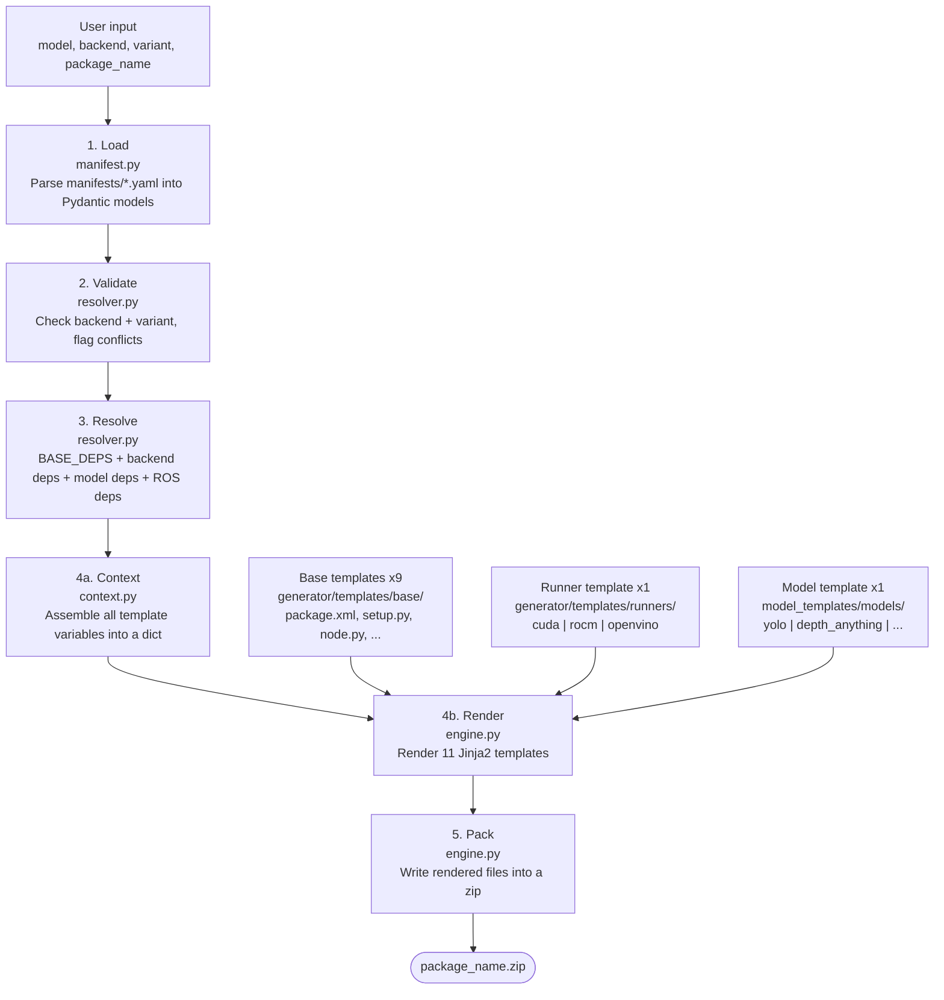
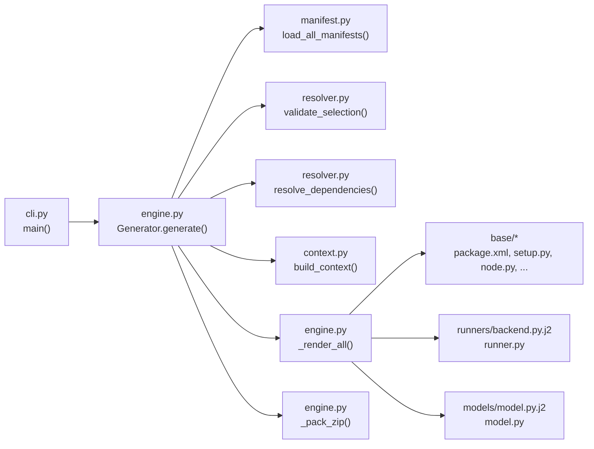

# vision-factory

A CLI tool that generates self-contained ROS2 vision packages. Pick a model, a hardware backend, and a variant — get a ready-to-build colcon package as a zip file.

## Supported Models

| Model | Output | Variants |
|-------|--------|----------|
| YOLO | Object detection (xyxy) | v8n, v8s, v8m, v8l, v8x, v11n, v11s, v11m, v11l |
| Depth Anything | Depth map | vits, vitb, vitl (v1 & v2) |
| Grounding DINO | Detection + text prompts | tiny, base |
| Segment Anything | Segmentation masks | hiera_t/s/b+/l, large, huge |
| Florence | Multi-task VLM | base, base-ft, large, large-ft |
| RTMPose | Keypoint detection | body-s/m/l, hand, face, wholebody-s/m/l |
| ZoeDepth | Monocular depth | nyu, kitti, nyu-kitti |
| ByteTrack | Multi-object tracking | - |

## Supported Backends

| Backend | Device | Torch Index |
|---------|--------|-------------|
| `cuda` | NVIDIA GPU | `cu124` |
| `rocm` | AMD GPU | `rocm6.2` |
| `openvino` | Intel CPU/iGPU | - |

## Installation

```bash
pip install -e .

# For development (includes pytest)
pip install -e ".[dev]"
```

## Usage

### Generate a package

```bash
vision-gen generate \
  --model yolo \
  --backend cuda \
  --variant yolo_v8s \
  --package-name my_detector \
  --output ./output
```

### List available models

```bash
vision-gen list-models
```

### Get model details

```bash
vision-gen info yolo
```

### Custom paths

```bash
vision-gen generate \
  --model yolo \
  --backend cuda \
  --package-name my_pkg \
  --manifests /path/to/manifests \
  --model-templates /path/to/templates
```

## Generated Package Structure

Each generated zip contains a complete ROS2 colcon package:

```
my_detector/
├── my_detector/
│   ├── __init__.py
│   ├── node.py           # ROS2 node entry point
│   ├── model.py          # Model loading and inference
│   └── runner.py         # Backend-specific inference runner
├── config/
│   └── params.yaml       # ROS2 parameters
├── launch/
│   └── vision.launch.py  # Launch file
├── package.xml           # ROS2 package manifest
├── setup.py              # Python package setup
├── requirements.txt      # pip dependencies
├── Dockerfile            # Container build
└── README.md             # Package documentation
```

## Project Structure

```
vision-factory/
├── generator/              # Core engine
│   ├── cli.py              # Click CLI
│   ├── engine.py           # Generation pipeline
│   ├── manifest.py         # YAML manifest parsing (Pydantic)
│   ├── resolver.py         # Dependency resolution
│   ├── context.py          # Jinja2 context builder
│   └── templates/          # Jinja2 templates
│       ├── base/           # ROS2 package scaffolding (9 templates)
│       └── runners/        # Backend runners (cuda, rocm, openvino)
├── manifests/              # Model definitions (8 YAML files)
├── model_templates/        # Model-specific implementations (Jinja2)
│   └── models/
└── tests/                  # pytest suite
```

## Testing

```bash
pytest
pytest -v                      # verbose
pytest tests/test_engine.py    # specific file
```

## How It Works

The generator follows a five-stage pipeline: **load → validate → resolve → render → pack**.



### Template layers

There are three layers of templates, each handling a different concern:

**Base templates** (`generator/templates/base/`) — 9 files that produce the ROS2 package scaffolding. Model-agnostic, using Jinja2 conditionals on `output_type`, `has_text_input`, etc. The most important is `node.py.j2`, which generates the ROS2 node wiring subscribers, publishers, and the inference loop.

**Runner templates** (`generator/templates/runners/`) — one per backend. Each produces a `runner.py` that handles device setup and calls the model's inference methods. Selected by the `backend` parameter.

**Model templates** (`model_templates/models/`) — one per model architecture. Each produces a `model.py` with model-specific loading and inference logic. If no template exists, a placeholder is generated.

### Call chain



## Adding a New Model

1. Create `manifests/model_name.yaml` defining the model's I/O schema, variants, and ROS config
2. Create `model_templates/models/model_name.py.j2` with the model loading/inference logic
3. Add an entry to `MODEL_DEPS` in `generator/resolver.py` with the model's pip dependencies
4. Run `pytest` to validate
