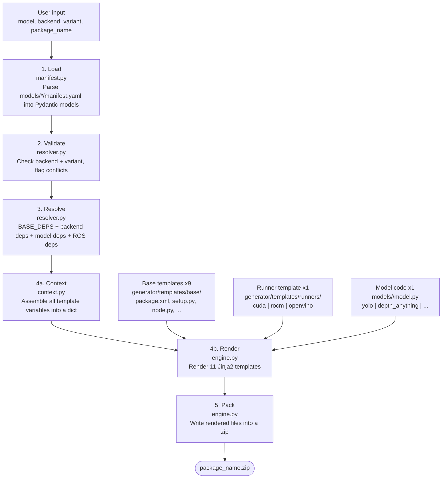
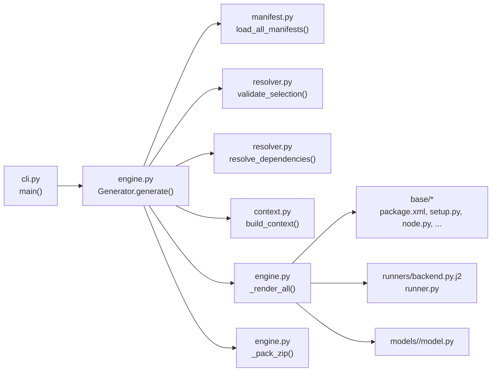

# Architecture

## How It Works

The generator follows a five-stage pipeline: **load → validate → resolve → render → pack**.



## Template layers

There are three layers of templates, each handling a different concern:

**Base templates** (`generator/templates/base/`) — 9 files that produce the ROS2 package scaffolding. Model-agnostic, using Jinja2 conditionals on `output_type`, `has_text_input`, etc. The most important is `node.py.j2`, which generates the ROS2 node wiring subscribers, publishers, and the inference loop.

**Runner templates** (`generator/templates/runners/`) — one per backend. Each produces a `runner.py` that handles device setup and calls the model's inference methods. Selected by the `backend` parameter.

**Model code** (`models/<model>/`) — one per model architecture. Each provides a `model.py` with model-specific loading and inference logic. Models that need backend-specific methods (e.g. YOLO) split into `model_base.py` (shared code) plus `model_tensorrt.py`, `model_onnx.py`, etc. The engine picks `model_{backend}.py` when it exists, otherwise falls back to `model.py`. If no model file exists at all, a placeholder is generated.

## Call chain



## Generated Package Structure

Each generated zip contains a complete ROS2 colcon package:

```
my_detector/
├── my_detector/
│   ├── __init__.py
│   ├── node.py           # ROS2 node entry point
│   ├── model_base.py     # Shared model code (if backend-specific)
│   ├── model.py          # Model loading and inference
│   └── runner.py         # Backend-specific inference runner
├── config/
│   └── params.yaml       # ROS2 parameters
├── launch/
│   └── vision.launch.py  # Launch file
├── package.xml           # ROS2 package manifest
├── setup.py              # Python package setup
├── requirements.txt      # pip dependencies
├── Dockerfile            # Container build
└── README.md             # Package documentation
```

## Project Structure

```
vision-factory/
├── generator/              # Core engine
│   ├── cli.py              # Click CLI
│   ├── engine.py           # Generation pipeline
│   ├── manifest.py         # YAML manifest parsing (Pydantic)
│   ├── resolver.py         # Dependency resolution
│   ├── context.py          # Jinja2 context builder
│   └── templates/          # Jinja2 templates
│       ├── base/           # ROS2 package scaffolding (9 templates)
│       └── runners/        # Backend runners (cuda, rocm, openvino, tensorrt, onnx)
├── models/                 # Model definitions + implementations
│   ├── base_model.py       # Shared HF base class (copied into packages)
│   ├── yolo/
│   │   ├── manifest.yaml   # Model manifest
│   │   ├── model_base.py   # Shared model code
│   │   ├── model.py        # Default backend (re-exports base)
│   │   ├── model_tensorrt.py # TensorRT export/load
│   │   └── model_onnx.py   # ONNX export/load
│   ├── depth_anything/
│   │   ├── manifest.yaml
│   │   └── model.py
│   ├── grounding_dino/
│   │   ├── manifest.yaml
│   │   └── model.py
│   └── .../                # Other models (manifest.yaml only until implemented)
└── tests/                  # pytest suite
```
